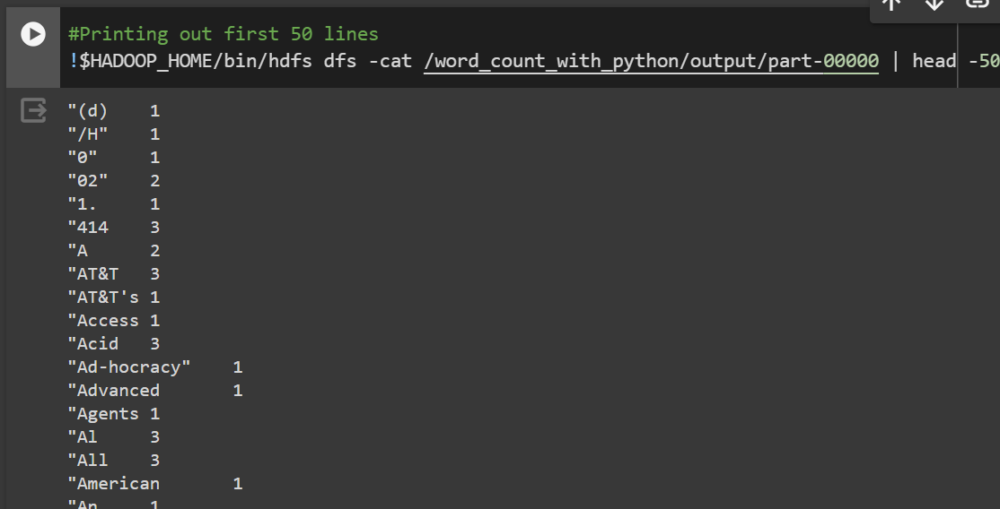

# Hadoop Streaming Using Python
The utility will create a Map/Reduce job, submit the job to an appropriate cluster, and monitor the progress of the job until it completes.

# Short Explanation
- The mapper.py script reads lines of text from standard input, splits each line into words, and outputs each word along with the count 1 to standard output. 
- The reduce.py script reads the output of the mapper.py script, which is sorted by key (the word), and aggregates the counts for each word. It then outputs each word along with its total count.

# Expected Output 

The expected output of running these MapReduce scripts would be the aggregated word counts. Specifically:

- Each word encountered in the input data will be output along with its total count.
- The output will be sorted alphabetically by word.

